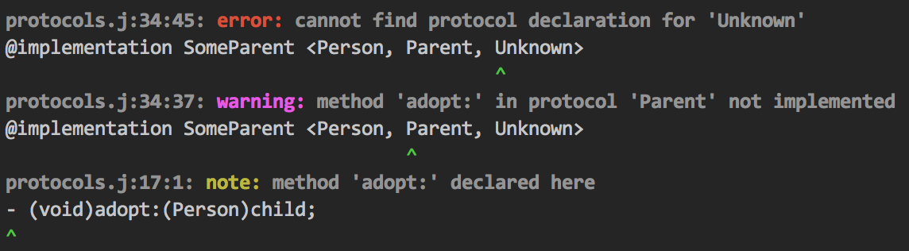

acorn-issue-handler
===================

This module provides robust error tracking and reporting for errors arising from [acorn] parsing or from compilers which use an acorn AST.

To use this module, you must provide an array to which issues may be added. There are three types of issues supported by this module: error, warning, and note. There are simple functions provided to add an issue of each type. In addition, there is a function to add a SyntaxError thrown by acorn to the list of issues.

When you want a formatted dump, there is a single function you can call to either retrieve the formatted (and optionally colorized) text, or to log the formatted text to the console.

Here's an example of usage:

```js
var issueHandler = require('acorn-issue-handler');

// Some Compiler methods

Compiler.prototype.compileMethodStatement = function(node, scope, compileNode)
{
    var name = node.id.name,
        duplicate = this.currentClass.methods[name];

    if (duplicate)
    {
        issueHandler.addError(
            this.issues,
            this.source,
            this.file,
            node,
            "duplicate definition of method '%s'",
            selector
        );

        issueHandler.addNote(
            this.issues,
            this.source,
            this.file,
            duplicate.node,
            "original definition is here:"
        );
    }

    // and so on
}

var compiler = new Compiler(source, file);

compiler.compile();

var issues = compiler.getIssues();

if (issues.length > 0)
    issueHandler.logIssues(issues);
```

And here's an example of the formatted output:



## Functional API

The functional API is the recommended way to use this module. If your needs are more complex, you can use the [classes](#classes) directly.

### addError/addWarning/addError(issues, source, file, location, message, ...)

These functions add an issue of the appropriate subclass to the `issues` array and return the instance. The rest of the parameters are as follows:

 * **source** - The source code in which the issue occurred.
 * **file** - The path to the source code. This is not checked in any way for validity, so it may be virtual,
 for example '<command line>'.
 * **location** - Where the issue occurred. This may be an acorn Node object, an acorn SourceLocation object,
 a SyntaxError, any object which has zero-based `start` and `end` properties which are indexes into `source`,
 or a number which represents a zero-based index into `source`.
 * **message** - The message to display to the user.

As a convenience, `message` may be a format string in the form used by [util.format](https://nodejs.org/api/util.html#util_util_format_format), followed by the arguments for the format string. For example:

```js
issueHandler.addError(
    issues, source, file,
    superclassNode,
    "cannot find implementation declaration for '%s', superclass of '%s'",
    superclassNode.name,
    name
);
```

### addAcornError(issues, error, source, file)

This function converts a SyntaxError thrown by acorn (which has added location information) into an [Error](#errorsource-file-location-message-extends-issue) instance, adds the instance to `issues`, and returns the instance. Typically you would use it like this:

```js
var issues = [],
    ast;

try
{
    ast = acorn.parse(source, options);
}
catch (ex)
{
    if (ex instanceof SyntaxError)
        issueHandler.addAcornError(issues, ex, source, file);
}

if (issues.length > 0)
    issueHandler.logIssues(issues);
```

### getErrorCount(issues)

Returns the number of instances in issues for which `isError` returns `true`.

### getWarningCount(issues)

Returns the number of instances in issues for which `isWarning` returns `true`.

### getFormattedIssues(issues, colorize)

This convenience method instantiates a [StandardReporter](#standardreportercolorize), calls its [report](#standardreporterreportissues) method, and returns the result. If `colorize` is not passed or is `true`, the result is colorized.

### logIssues(issues, colorize)

This convenience method instantiates a [ConsoleReporter](#consolereportercolorize-extends-standardreporter) and calls its [report](#standardreporterreportissues) method. If `colorize` is not passed or is `true`, the result is colorized.

### setColorMap(map)

This module uses [chalk](https://github.com/chalk/chalk) to colorize its output. By default, the different parts of a formatted message are colorized with the following colors:

Name     | Color
:------- | :-----
file     | chalk.gray.bold
location | chalk.gray.bold
error    | chalk.red.bold
warning  | chalk.magenta.bold
note     | chalk.yellow.bold
message  | chalk.gray.bold
source   | null
caret    | chalk.green

For more information on what the parts of a formatted message are, see [getFormattedMessage](#issuegetformattedmessagecolorize). Note that "error", "warning" and "note" in the table above represent the three possible values for `<severity>`.

You can customize the colors by calling this function with your own mapping. You do not need to set all of the values in `map` if you only wish to override a few colors; only values in the default mapping whose keys are in `map` will be replaced. To turn off colorizing for a key, pass `null` as the value.

Note that you will need to require `chalk` in your code, as the values in `map` are `chalk` functions, not strings. Also note that whatever changes you make will affect all modules that require this module.

## Classes

The API is built on two key classes, `Issue` and `Reporter`, along with their subclasses. Typically you would never instantiate these classes directly, but use the [functional API](#functional-api) for constructing and operating on one of these classes.

### Issue(source, file, location, message, severity) \[extends SyntaxError]

This class serves as the base class for all issues, and contains most of the functionality. You should **not** construct an Issue directly; use the functional API to create a subclass of `Issue` and add it to an array of issues.

 * **source** - The source code in which the issue occurred.
 * **file** - The path to the source code. This is not checked in any way for validity, so it may be virtual, for example '<command line>'.
 * **location** - Where the issue occurred. This may be an acorn Node object, an acorn SourceLocation object, a SyntaxError, any object which has zero-based `start` and `end` properties which are indexes into `source`, or a number which represents a zero-based index into `source`.
 * **message** - The message to display to the user.
 * **severity** - Should be "error", "warning" or "note".

### Issue#isError()

Returns `true` if the object is an instance of this module's `Error` class (not the global `Error` class).

### Issue#isWarning()

Returns `true` if the object is an instance of this module's `Warning` class.

### Issue#isNote()

Returns `true` if the object is an instance of this module's `Note` class.

### Issue#getFormattedMessage(colorize)

Returns a representation of the error message within its context. If `colorize` is not passed or is `true`, the result is colorized. The structure of a formatted error message is as follows:

    <file>:<location>: <severity>: <message>
    <source>
    <caret>

The caret indicates the position within the source line where the error occurred.

You can change the colors with the [setColorMap](#setcolormapmap) function.

### Issue#getStackTrace(filter)

Returns a stack trace for this issue, filtering out function calls within this module. If you wish to filter out all function calls above one of your own functions, `filter` is an array of strings representing function names that might appear in the stack trace. If one of the names in `filter` appears in the stack trace, that call and all those above it will be filtered out. A regex is used for matching, so be sure to regex escape the text in `filter`, for example: `['Parser\\.acorn.Parser\\.objj_raise']`.

### Error(source, file, location, message) \[extends Issue]

A subclass of `Issue` that represents an error.

### Warning(source, file, location, message) \[extends Issue]

A subclass of `Issue` that represents a warning.

### Note(source, file, location, message) \[extends Issue]

A subclass of `Issue` that represents a note to be displayed to the user with contextual information.

### StandardReporter(colorize)

This is the usual class used to get formatted output from an array of issues. If `colorize` is not passed or is `true`, the output will be colorized.

Normally you would not instantiate this class directly, but use the [getFormattedIssues](#getformattedissuesissues-colorize) function instead.

### StandardReporter#report(issues)

Given an array of `Issue` instances (or subclasses thereof), builds a string by calling `getFormattedMessage` on each instance, and then adds a summary of how many errors and/or warnings there were. The result is returned. If issues is an empty array, an empty string is returned.

Normally you would not call this method directly, but use the [getFormattedIssues](#getformattedissuesissues-colorize) function instead.

### ConsoleReporter(colorize) \[extends StandardReporter]

This class has a `report` method that calls `StandardReporter#report` and then sends the result to the console.

### SilentReporter

This class' `report` method does nothing. By using this reporter, you can suppress issue logging without changing any other code.

[acorn]: https://github.com/marijnh/acorn
